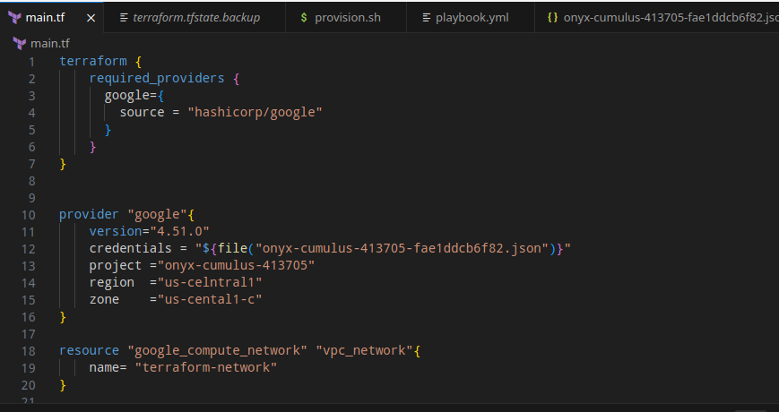
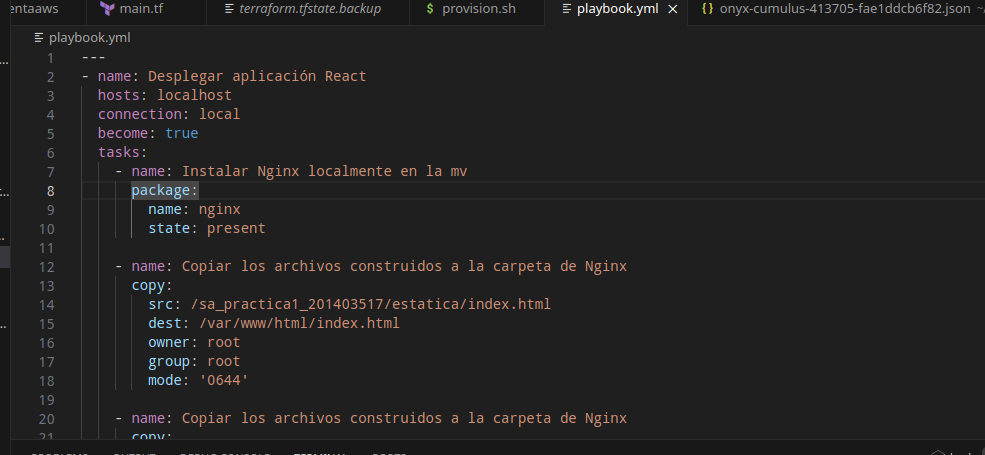
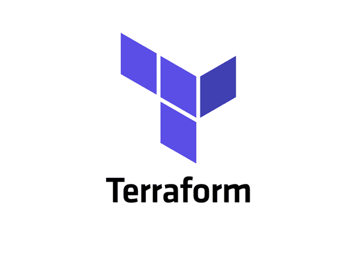
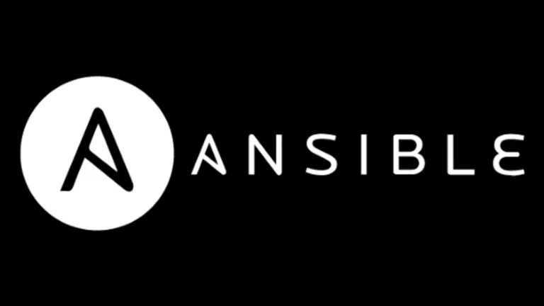

# Practica 1
## Luis Roberto Boror Yoc
## 201403517  
## Software Avanzado B

##*Instalacion terraform*  
  
Para la instalacion en majaro linux solo se necesita el siguiente comando:  
  
`pamac install terraform`

Crear un archivo con extension  main.tf para el codigo:  

**Si nunca se a iniciado usar el comando:**

`terraform init`

**Para ver que se va a ejecutar el comando:**

`terraform plan`

**Para ejecutar el archivo .tf ejecutar el comando:**
  
`terraform apply`

##*Instalacion ansible*  

**para instalar ansible se usa el comando:**

`sudo apt-get install -y ansible`

**crear archivo .yml para crear un playbook**

##Definicion de tecnologias usadas
#Terraform
Terraform es una herramienta de codificación declarativa que permite a los desarrolladores utilizar un lenguaje de configuración denominado HCL (HashiCorp Configuration Language) para describir la nube de "estado final" deseada o la infraestructura local para ejecutar una aplicación. 

#Ansible

Ansible es una plataforma de automatización de código abierto que puede utilizarse para gestionar grandes grupos de sistemas informáticos. Te ayuda a automatizar el despliegue de aplicaciones, la gestión de la configuración, el aprovisionamiento en la nube, la actualización de estaciones de trabajo y servidores, entre otras muchas tareas. 

#GCP
Google Cloud (también conocido como Google Cloud Platform o GCP) es un proveedor de recursos de computación en la nube que se utilizan para desarrollar, implementar y operar aplicaciones en la web.

La plataforma de Google es una infraestructura completa que cuenta con varias características y herramientas, para que las empresas puedan tener una gestión más eficiente y una seguridad digital completa.

